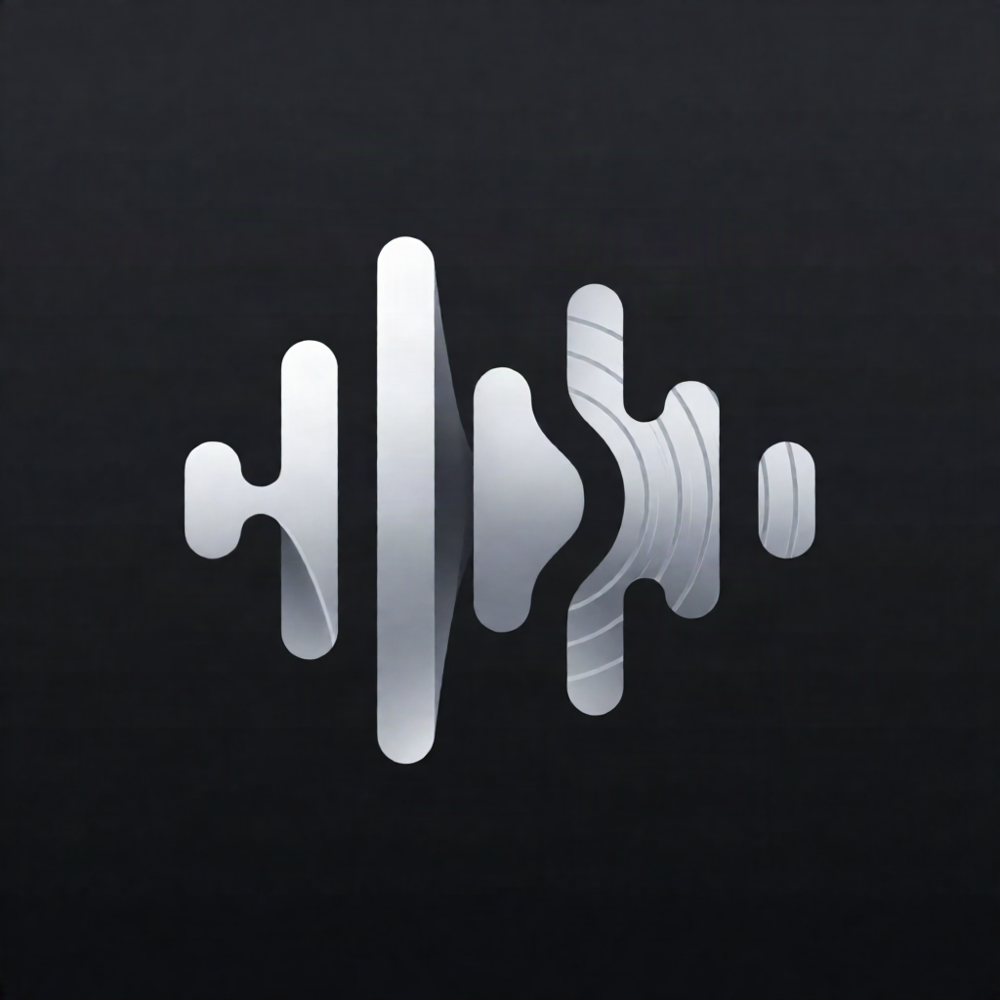
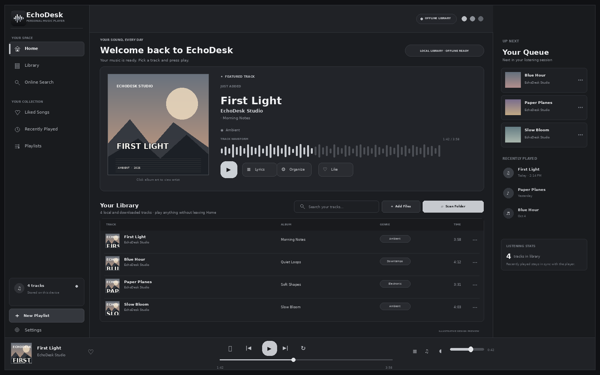
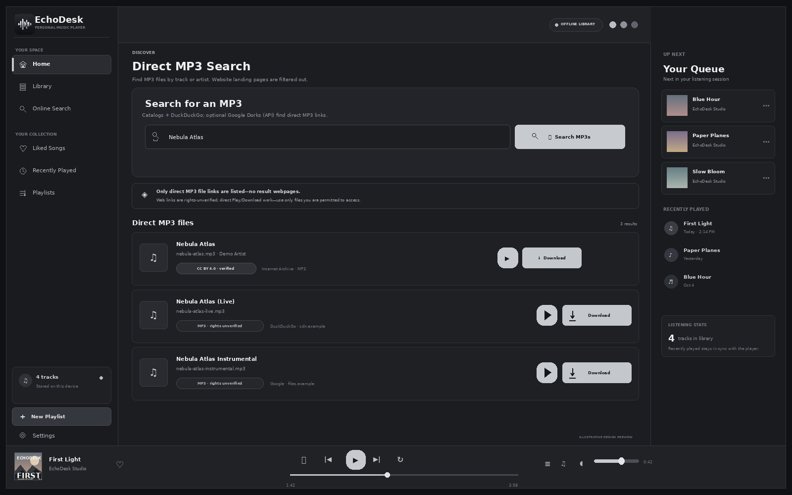

<p align="center"></p>

# EchoDesk — راهنمای فارسی

<p align="center"><strong>پخش‌کنندهٔ موسیقی دسکتاپ با کتابخانهٔ محلی</strong></p>

<p align="center"><a href="README.fa.md">فارسی</a> · <a href="README.md">English</a></p>  
**نسخه:** 1.0.5 · پخش‌کنندهٔ موسیقی دسکتاپ و محلی

EchoDesk کتابخانهٔ موسیقی شخصی شما را روی دستگاه نگه می‌دارد و با رابطی انگلیسی، تم روشن/تیره و ظاهر خاکستری/ذغالی کار می‌کند. برنامه با Python، HTML، CSS و JavaScript ساخته شده و در نسخهٔ دسکتاپ از pywebview استفاده می‌کند.

## پیش‌نمایش‌ها

> تصاویر زیر **ماکاپ طراحی** هستند، نه اسکرین‌شات ثبت‌شده از اجرای EXE ویندوز. برای افزودن اسکرین‌شات واقعی، برنامه را روی ویندوز اجرا و تصویر را در همین مخزن جایگزین/اضافه کنید.





## امکانات

- افزودن فایل‌های صوتی و اسکن پوشه‌ها؛ فایل‌های اصلی جابه‌جا یا ویرایش نمی‌شوند.
- فهرست کتابخانهٔ قابل جست‌وجو در Home، آهنگ‌های پسندیده، تاریخچهٔ پخش و پلی‌لیست‌ها.
- پخش، جست‌وجو در فایل‌ها، موج صدا، صف پخش، تکرار، shuffle و تنظیم صدا.
- همگام‌سازی فراداده: تصویر کاور از iTunes Search، تصویر هنرمند از Deezer با جایگزین Wikipedia، و متن ترانه از LRCLIB با جایگزین Lyrics.ovh.
- جست‌وجوی MP3 مستقیم در Internet Archive، Openverse و DuckDuckGo؛ در صورت تنظیم API گوگل، دو جست‌وجوی Google Dorks نیز اضافه می‌شود.
- پشتیبان ZIP از اطلاعات کتابخانه، تنظیمات و فرادادهٔ ذخیره‌شده.
- پنجرهٔ بدون قاب؛ سطح کشیدن در نوار بالایی زیر دکمه‌های پنجره قرار می‌گیرد.

## اجرا در ویندوز

1. Python 3.10 یا جدیدتر و **Microsoft Edge WebView2 Runtime** را نصب کنید.
2. پوشهٔ پروژه را استخراج کنید.
3. در PowerShell، از پوشهٔ پروژه اجرا کنید:

```powershell
.\run.bat
```

برای ساخت EXE، اجرا کنید:

```powershell
.\build_exe.bat
```

فایل ساخت، آیکون `web/assets/echodesk-icon.ico` را مستقیماً به PyInstaller می‌دهد و این خروجی‌ها را می‌سازد:

- `dist/EchoDesk.exe`
- `dist/EchoDesk-1.0.5.exe` (نام نسخه‌دار برای جلوگیری از اشتباه با فایل یا آیکون cache‌شدهٔ قبلی)

ساخت EXE باید روی ویندوز انجام شود. پس از ساخت، سطح خالی نوار بالایی را با نگه‌داشتن دکمهٔ چپ ماوس بکشید؛ روی خود دکمه‌های minimize/maximize/close، کلیک باید عمل خود دکمه را انجام دهد.

## پیش‌نمایش مرورگر

```powershell
.\run_web.bat
```

پیش‌نمایش مرورگر از برخی قابلیت‌های مختص دسکتاپ، مثل دسترسی دائمی به پوشه‌های محلی، پشتیبانی نمی‌کند.

## جست‌وجوی آنلاین و Google Dorks

Google Dorks از طریق **Google Programmable Search API رسمی** اجرا می‌شود؛ برنامه HTML گوگل را scrape نمی‌کند. دو عبارت جست‌وجو استفاده می‌شوند:

- `"نام آهنگ یا هنرمند" filetype:mp3`
- `inurl:mp3 "نام آهنگ یا هنرمند" filetype:mp3`

برای فعال‌کردن آن، یک Programmable Search Engine بسازید و این دو متغیر محیطی را پیش از اجرای EchoDesk تنظیم کنید:

```powershell
$env:ECHODESK_GOOGLE_API_KEY = "کلید-API-خودتان"
$env:ECHODESK_GOOGLE_CSE_ID = "شناسه-موتور-جست‌وجو"
.\run.bat
```

محدودیت سهمیه و هزینهٔ احتمالی را در حساب گوگل خود بررسی کنید. کلیدها را در سورس، README، اسکرین‌شات یا ریپوی عمومی قرار ندهید. برای پوشش گسترده، تنظیم موتور جست‌وجو را روی جست‌وجوی وب کامل بگذارید.

فقط لینک مستقیم HTTPS با پسوند `.mp3` نمایش داده می‌شود؛ صفحه‌های وب حذف می‌شوند. نبودن اطلاعات مجوز به معنی مجازبودن فایل نیست: این نتایج با برچسب **Rights not verified** نشان داده می‌شوند. پخش/دانلود فقط وقتی باید انجام شود که خودتان اجازهٔ دسترسی و استفاده از فایل را دارید. میزبان‌های خصوصی و redirectهای ناامن مسدود می‌شوند.

## انتشار در GitHub (اختیاری)

در یک استخراج تازه از ZIP، Git for Windows و GitHub CLI را نصب کنید. سپس در PowerShell و از پوشهٔ پروژه اجرا کنید:

```powershell
Set-ExecutionPolicy -Scope Process Bypass -Force
.\publish_to_github.ps1
```

این اسکریپت در صورت نیاز ورود مرورگری GitHub CLI را اجرا می‌کند؛ از شما PAT نمی‌خواهد و توکن را در پروژه ذخیره نمی‌کند. پیش‌فرض ریپو **خصوصی** است، فایل‌های staged را برای بازبینی نشان می‌دهد و قبل از ساخت ریپو/آپلود، تأیید صریح می‌گیرد. اگر عمومی را انتخاب کنید و ایمیل تماس در فایل‌ها باشد، اسکریپت هشدار می‌دهد.

## پوشهٔ داده‌ها

در ویندوز، تنظیمات، کتابخانه و فایل‌های مدیریت‌شده در مسیر زیر نگه‌داری می‌شوند:

```text
%APPDATA%\EchoDesk
```

فایل‌های اصلی‌ای که خودتان وارد می‌کنید در محل اصلی‌شان باقی می‌مانند؛ دانلودهای مدیریت‌شده و فراداده در زیرپوشه‌های EchoDesk ذخیره می‌شوند.

## ساختار و مستندات

- `README.md` — مستندات انگلیسی
- `README.fa.md` — همین مستندات فارسی
- `CHANGELOG.md` — تغییرات نسخه‌ها
- `build_exe.bat` — ساخت EXE ویندوز با آیکون برنامه
- `design-preview.png`, `design-search.png` — پیش‌نمایش‌های طراحی، نه اسکرین‌شات واقعی

## مجوز و انتساب

در این نسخه فایل مجوز متن‌باز اضافه نشده است؛ بنابراین تا زمانی که صاحب پروژه مجوزی انتخاب نکند، استفادهٔ مجدد از سورس یا دارایی‌ها را مجاز فرض نکنید. انتساب فعلی برنامه: `behnam Ehsani` · `inbox.ehsani@gmail.com`.
